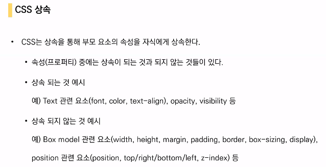
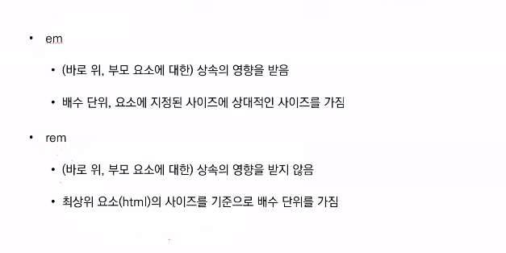
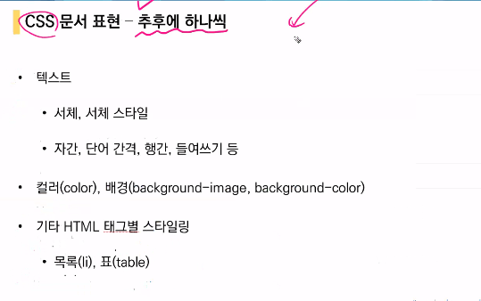
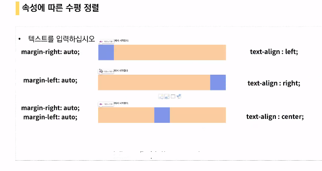
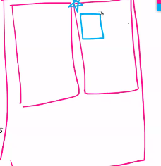

#  Web

html / css 

문법이 크게 없고 암기느낌으로!!

### HTML

웹페이지를 작성하는 도구

HTML을 읽어서 웹브라우저가 우리에게 보여주는 것

웹 수업시에는 크롬사용!!

HTML은 언어가 아니고 마크업 문법의 일종임

md도 마크업 문법의 하나

태그를 이용해서 작성한다는 큰 틀에서는 같다

현재는 표준이1개! ----------- WHATWG

당장 필요한 기능부터 넣자(단계적 버전업 X)

크롬만이 브라우저이다

공부하다가 궁금한게 생길때

**mdn**을 앞에 무조건 붙이고 구글링!!!!

https://developer.mozilla.org/en-US/docs/Web/HTML

여기 참고!!!

ex) mdn input (input모를때 앞에 mdn을 붙이고 검색)

**w3school**

수업 내용뿐만 아니라 웹 개발은 직접 찾아보고 하면서 공부해야함!(퀴즈 등 다양함)

웹에서는 vs code 사용!!

익스텐션 설치!!

쓰면서 편한 익스텐션 있으면 설치하면됨!(처음엔 손으로 쓰는거 추천)

html은 들여쓰기가 2칸임

크롬 개발자도구 !!! 주구장창 쓸것

css javascript 등 소스코드를 다같이 볼 수 있음

웹 사이트를 만드는 것 -- 웹 프로그래밍

크게 2가지로 나눌 수 있음

프론트 엔드 (우리눈에 보여지는 화면)// 백엔드 (데이터와 로직을 담당)

2개다 잘하면 풀스텍(몇년의 경력 필수)

프론트엔드는 크게 3가지로 나눔

HTML 웹 페이지 구조 생성 

CSS    웹 페이지 스타일링(디자인)

JS       웹 페이지 기능추가(웹 페이지 조작)

밑으로 갈수록 복잡해짐

HYPER - 초월하다, 뛰어넘다

텍스트를 초월하고 뛰어넘어서 이동함(하이퍼링크를 이용해서)

hyper link - 다른 페이지나 아래나 위로 이동

마크업 언어

마크(태그)로 둘러싸인 언어

**태그로 데이터와 문서의 구조를 표현!**

헤드 - 여러 데이터 정의 또는 정보를 적어주는 부분

바디 - 우리눈에 보이는 부분

title이라는 태그를 적으면 

삼성전자서비스 앞에 아이콘을 파비콘이라고 함

마크다운은 마크업을 이용해서 만든 언어

업 다운은 위 아래라는 의미가 아님

마크다운은 마크업에 속함

확장자는 .html

## HTML기본구조

가장 기본구조

기본구조 만들어놓고 채워나가는 것

lang='ko'는 언어 말하는것(영어, 한국어 등)

메타 데이터 -- 데이터의 데이터(다른 데이터를 설명해주는 데이터)

DOM(Document Object Model) 트리

문서를 각각을 객체로 만든 트리구조

문서를 조금더 구조화된 형태로 볼 수 있음

html, head, title이라는 각 요소에 쉽게 접근/수정 가능

마크업 스타일 가이드(들여쓰기 2칸)

* 가끔 닫는 태그 없는 특수 케이스도 있음

태그이름은 대소문자 구분하지 않음(**BUT소문자로 써야됨!**)

웹은 잘못써도 에러가 안나서 디버깅이 쉽지 않다

디버깅 도와주는 것이 개발자도구!!

닫는태그도 없고 내용도 없음

br은 줄바꿈  (br/은 예전버전)

중첩가능(헤드안에 타이틀.. 이런거)

속성명 = "속성값"  

속성명=속성값 사이 공백은 없어야함

href는 어떤 태그와 같이 사용하는지 짝이 있음

하지만 태그와 상관없이 사용가능한 속성도 있다

**id / class/ style 만 알아도됨!!**

어떤 속성을 딱 집을 때 id나 class를 붙이면 됨

data-*은 자바스크립트나 장고할 때 많이 사용!

html 주석

<!-- 하면 주석 나옴

아니면 ctrl + /

a는 1증가해서 기본적으로 탭으로 찍는다!

* 시맨틱 태그

이름만 보고 태그가 어디에 위치할지 대략적으로 감을 잡기 위함

**div 나 span p 태그를 제외한 거의 대부분의 태그들이 시맨틱 태그이다!!**

시험나오기좋음!!!

div는 하나의 구역을 나타냄(박스상자)

시맨틱태그를 잘 써주지 않으면 읽기 매우 어렵다

시맨틱태그를 잘 쓰면 검색엔진최적화 가능

h1 은 소제목 표현시 사용(의미를 가짐)

개발자도구에서 웹브라우저상에 하나하나 보면서 어떻게 작성되어있는지 알 수 있음

## HTML 문서 구조화

블록 - 자리차지하는 요소

인라인 - 라인 안쪽으로 들어가는요소

strong태그는 사이에 있는 텍스트를 강조하고 싶을 때 사용(좀더 시맨틱한 요소가 들어가있음)

i 보다는 em이 시맨틱한 의미가 있다(기능은 같지만)

img는  라는 형태가 될것(~에는 이미지 주소(바탕화면인지 웹인지..))

span  특별한 의미가 없는 인라인 요소(시맨틱한요소 x) - 그냥 하나의 태그로 묶을 수 있다정도

p는 어디에 들어가는 문단인지 안나와있어서 시맨틱x

hr은 마크다운에서 --- 와같은 의미

pre 는 공백문자를 유지한다는 거에서 더 큰 의미를 가짐(글꼴이나 크기도 미리 정의되어있는거롤 사용해버림)

div 가장많이 사용!! (블록 레벨 컨테이너)

p와 div 의 차이

p는 p 안쪽에 인라인 요소(하나의 문장 안에 들어갈 수 있는 것)만 안쪽에 들어가야함

p태그안에 div는 불가능

div안에 p태그는 가능

이것이 차이!

보통 한 페이지 내에서 구역을 나눌 때 div태그 사용

thead, tbody, tfoot시맨틱태그들이다

가로칸을 먼저만들고 세로칸을 채운다

----> 이것은 문제로 많이나옴

몇칸을 병합할 것인지

row는 가로   col은 세로

**colspan, rowspan은 반대로 생각하면됨**   

colspan은 세로인것 2개를 합치면 가로로 합쳐짐

rowspan은 가로선을 지워서 세로로 병합됨

colspan은 눈에보이는 것은 같아보여도 개발자도구에서 보면 다르게 보임

직접 만들기보다는 디자이너가 만들어준것을 주로 씀

form - 사용자에게 인풋을 받기위한 태그

**action , method 가 매우 중요!!!**

action은 form에 담은 정보를 어디로 보낼건지 명시

method는 데이터를 제출할 때 어떤 방식으로 제출할건지 지정(GET 또는 POST)

GET방식은 내가 담은 데이터를 쿼리스트링에 담아서 요청보냄

required는 무조건 입력해줘야한다는 것

밑에 여러개 적혀있는것들은 필요할때마다 찾아서 사용하면됨!!

사용자입력을 받아서 구글 서버로 전송하는 과정을 처리하는 것이 form

GET방식은 보안이 매우 약함(보여도 괜찮은 데이터들을 요청할 때)

GET방식은 쿼리스트링으로 입력한 데이터가 전달됨

메소드 안적으면 기본이 get방식

name역할은 데이터를 전송할 때 어떤 데이터인지 명시해주는 역할

쿼리스트링의 key로 들어감

입력받는 타입에 따라 입력받는 form의 형태도 달라진다

input을 도와주는 역할

**input의 id와 label의 for 는 같게 설정해줘야함!!**

div와 br 하면 보이는건 같지만 div는 하나의 블럭형태

label과 input의 속성값들

input type="submit"  제출버튼 생김

autofocus - 자동으로 커서가 깜빡

disabled는 값 못치게 함( value= "" 해주면 기본값으로 지정해서 수정못하게 가능)

이외에도 굉장히 많음(mdn input으로 검색하면 매우 많이 나옴)

**html과 css는 검색이 생활화 되어야함**

hidden - 사용자에겐 안보여도 서버에 보낼 값이 있을 때 사용

checkbox는 name이 같아야한다!!

radio에서 name을 같게하지 않으면 다중 선택이 되므로 단일 선택을 하려면 name을 같게해야함

br은 2개넣으면 한칸더 엔터??

select 는 

보통은 id name for는 같은 이름으로!

선택했을 때 전송되는 값은 value= ~~ 여기에 있는값

실제로 보이는 글자는 <option>여기</option>

## CSS

Cascading Style Sheets

상위요소에 정의된 스타일이 하위요소들에게도 전달됨

구조는 html 디자인은 css

**스타일을 지정하기 위한 언어**

**선택하고, 스타일을 지정한다(2단계)**

h1 - 어디에 스타일을 입힐지

{} 안쪽에 스타일 정의

속성명 : 속성값의 형태 (각각 스타일의 마지막에는 ;으로 끝나야함)

**무조건 외부참조 사용해야함**(코드의 재사용성, 유지보수)

코드를 가져다 쓰기위해서는 이해해야하므로 배우는것!!!

**! Tab 하면 기본 구조가 나옴**

같은 css 파일은 하나의 파일로 묶으면 된다

**주로 활용하는 속성 위주로 기억하자!!!**

개발자도구

styles, computed, layout 이 3개로 css를 본다

취소선이 되어있는 것은 더 상위에 있는 요소에 의해 바뀌었다는 뜻

### CSS Selector

전체선택자는 * (모든 요소를 선택하게됨)

요소선택자는 태그명으로 선택(h1, h2, div, span,strong 등)

클래스선택자 css에는   .className{ 코드}   으로 명시

아이디선택자  css에는 #id_name{ 코드}   으로 명시    <a id = "id_name" 을 html에 해주면됨

속성선택자(많이 사용하지 않음) - 매우 다양한 속성 선택자 존재

**클래스 선택자, 아이디선택자 , 요소선택자, 전체선택자, 속성 선택자 순으로 많이사용함**

----

A,B는 태그라고 생각하면됨

요소들을 몇개를 묶어서 그 조건을 만족하는 애들을 선택하겠어 -- **결합자**

자손 결합자   A 한칸뛰고 B    - A를 만족하는 모든 하위요소 중에서 B를 만족하는 모든요소

자식 결합자 - A >B    - A의 자식중(B,D,E,...)에서 B를 만족하는 애들을 선택하겠다(B만 선택되는 것)

일반 형제 결합자 -  A~B    - A를 만족하는 형제요소들 중에 B를 만족하는 요소

인접 형제 결합자 -   A+B   - A의 모든 형제중에서 A 바로 다음에 오는 B만 선택하는것

----

의사 클래스/요소

의사 클래스 - 선택하고자 하는 HTML요소에 특정한 상태를 찝고 싶은것(마우스를 올렸다거나..등)

외우는 것이 아닌 찾아쓰면됨!

의사요소 - html에서 특정부분만 선택할 때

ul - list인데 순서가 없는 list

- **::first-letter** : 요소의 텍스트에서 첫 번째 글자에 스타일을 적용한다.블록타입의 요소에만 사용 가능하다.
- **::first-line** : 요소의 텍스트에서 첫 줄에 스타일을 적용한다.블록타입의 요소에만 사용 가능하다.
- **::before** : 요소의 콘텐츠 시작부분에 생성된 콘텐츠를 추가한다.

- **::after** : 요소의 콘텐츠 끝부분에 생성된 콘텐츠를 추가한다.

이것도 필요할 때 찾아쓰면됨!!

--한번에 쓰면 이렇게됨

엄청 길게는 실제로는 쓰지않는다 걱정no!

여러개중에 특정한 무언가를 받아야하기 때문에 이해해야한다

----

일반적으로 id는 하나의 문서에 1번만 사용

id_name 이 이름이 한개만 존재하는게 정석(1번만 사용하라는 것은 이름을 말하는것)

class는 여러개 전용

2번 우선순위는 **무조건 시험!!**

인라인 > id> class 까지는 무조건 외워야함

하나 안에 다 같이 들어가있으면 인라인만 적용(1순위이기 때문)

---그래서 인라인은 최대한 사용하지 않고 css파일로 빼서 사용하는게 맞음

1번 중요도는 우선순위를 무시하는것

하지만 사용하면 안됨(important를 써버리고 바꾸고싶으면 다시 important를 계속 써줘야함)

!important;

3번 css 파일 로딩순서

**같은 우선순위인데 나중에 정의된게 있으면 나중에 정의된것을 따름(위에서 아래로 읽기 때문에 맨 아래것으로!)**

**이런거 순서 시험문제로!!!**

----

부모에 있는 css 요소가 자동으로 자식에게!

inherit 을 써주면 상속되지 않는것도 상속시킬 수 있음(몰라도됨)

----

### CSS 기본 스타일

가변크기 / 고정크기

고정크기는 부모나 기타 등에 영향을 받지않고 일정함

가변크기- 디바이스, 부모 등에 따라 바뀜

가변크기를 훨씬 더 많이 사용!(크로스플랫폼 pc mobile 등에 다 가변적으로 적용- 반응형)

in - 운영체제마다 다름

pt -   1pt = 1/72 in

em과 rem이 중요!!!

상대적인 크기를 지니는 단위

**배수 단위**이다

* em

1em = 100%

1.5em = 150%

바로 위 부모 요소 크기에 대한 배수단위

* rem

바로 위 부모요소에 대한 상속 x

최상위 요소(html)의 사이즈를 기준으로 배수 단위를 가짐

-- 아마 시험...!

vw - 내가 보고있는 화면의 너비

vh - 내가 보고있는 화면의 높이

각각이 단위(width의 1/100이 1vw)

viewport 값의 1/100!

예:   100vw = 화면 너비 꽉차게라는뜻

화면크기 조정에따라 알아서 조정됨

vmin vmax 최소, 최대 크기를 정해놓을 수 있다(화면에 꽉차는 정사각형을 조정에따라 유지할 수 있다)

* RGB

HSL 색상은 쓸일없음

rgba는 투명도!!

**추후에 하나씩** ---- 필요한게 나올때마다 찾아보면서 공부하는게 html / css 이다

### Selectors 심화

## CSS Box Model

CSS의 꽃

모든 css는 박스요소로 동작함

모든 요소는 네모(박스모델)이고 위에서부터 아래로, 왼쪽에서 오른쪽으로 쌓인다

모든 요소가 왼쪽 상단에 붙으려는 성질이 있다 - normal flow

margin 다른 요소와의 거리(요소와 요소간의 거리)

padding 자신이 껴입는 것(컨텐트와 보더 사이 거리)

백그라운드 컬러 - 패딩까지 적용됨

한개만 주면 상하좌우가 같은값을 가지게됨(한번에 4개값 같게 줄 수 있음!)

1개는 같은값

2개는 십자가(상하 같고 좌우 같다)

3개는 나누기(위, 좌우는 같고, 아래)

4개는 시계방향

**시험나올것!!**

섞어도 동작은 잘한다

보더 - 테두리 기준

우리가 주는 width는 컨텐트 영역

## CSS Display

모든 요소는 박스모델이고 좌측상단에 배치

display에 따라 크기와 배치가 달라진다

block / inline 으로 나누어짐

block은 화면 크기 전체의 가로폭이기 때문에 바로 줄바꿈이 될수밖에없음

inline은 줄바꿈이 일어나지 않는 행의 일부요소 - text라고 생각하면됨

div, p form 정도는 블록레벨이라고 알고있기

css는 모든것이 박스이다

박스가 어떻게 쌓이는가를 배우는것

요소각각이 하나의 박스로 다닥다닥 붙어있는것임

주황색이 마진

확인할 때 꼭 width를 줘야함

inline-block     하나의 라인에 블럭과 다른요소를 같이 쓸 수 있음

----> 이러한 형태

visibility:hidden 은 화면에 표시는 안해도 공간은 차지함

display:none은 공간조차 부여안됨

**시험가능!!!**

## CSS Position

포지션을 어떻게 두는가

일반적인 요소의 배치순서 - normal flow

부모요소의 좌측상단으로 배치됨

normal flow를 벗어나게 할 수 있는 것들이 좌표 프로퍼티(겹치거나 그러고 싶을때)

fixed - 스크롤을 해도 viewport 기준으로 그 위치에 계속 보여짐(광고)

absolute도 fixed 와 비슷하지만 viewport 기준이 아니라 그냥 그 위치에 붙여버림(겹칠수도있음)

fixed, absolute 둘다 일반적인 문서흐름에서 제거됨, 둘다 저런 2차원 형태가 됨

relative 는 원래 자신의 static 위치를 기준으로 이동(normal flow를 따름)

fixed와 absolute는 붕 뜬다(자리차지 하지않음)

## 개발자도구

css든 html이든 다 조작가능하다

## 마무리

form - input -  label

